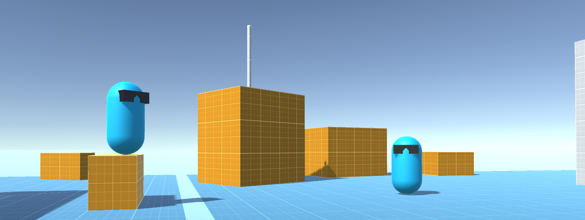

# Proto Character Controller
A simple prototype character using the Kinematic Character Controller asset

## Features

- **Configurable Movement:** all variables are exposed in-editor to allow for custom movement, e.g. ground speed, air control, jump count, etc.
- **Custom Input Handling:** Simple input manager based on Unreal Engine's default input config using Actions/delegates

## Required Packages:
- Kinematic Character Controller ([link](https://assetstore.unity.com/packages/tools/physics/kinematic-character-controller-99131))
- Starter Assets - First Person Character Controller ([link](https://assetstore.unity.com/packages/essentials/starter-assets-first-person-character-controller-196525))